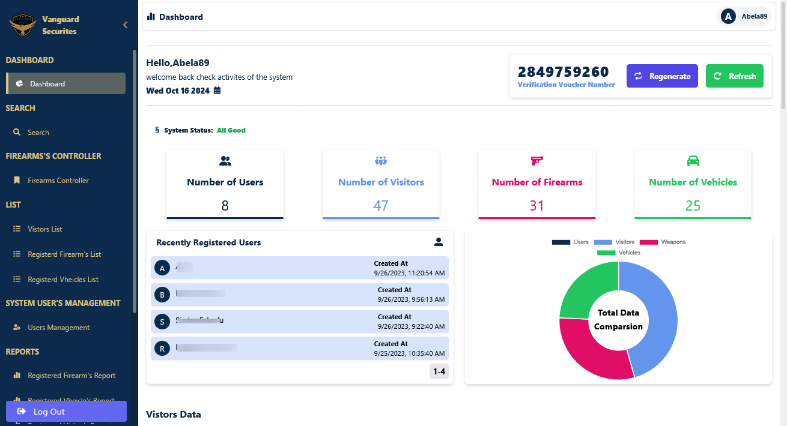
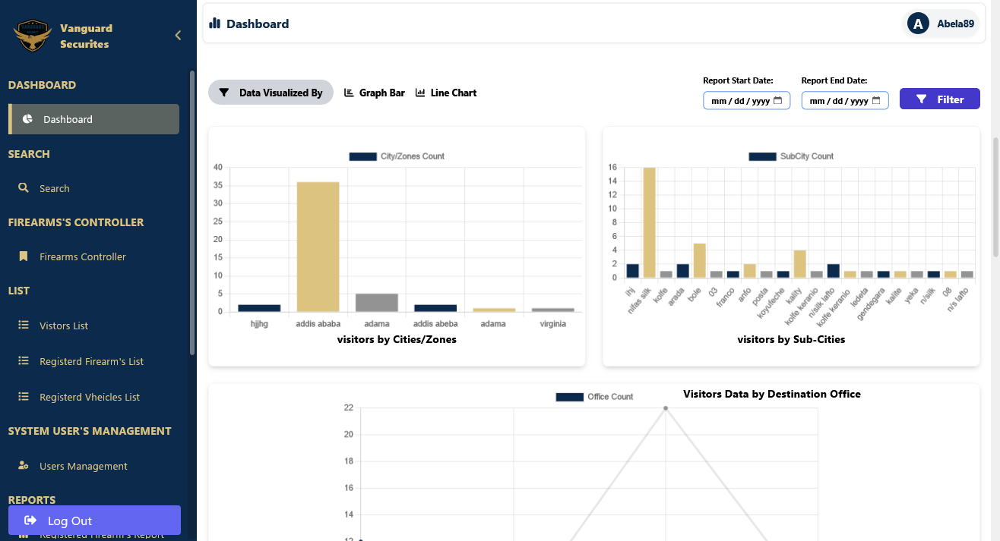
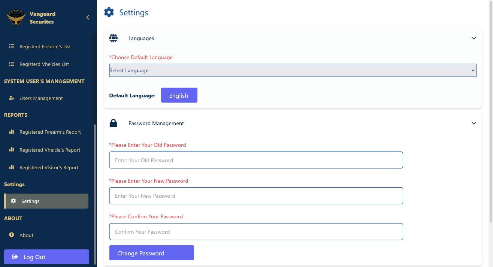
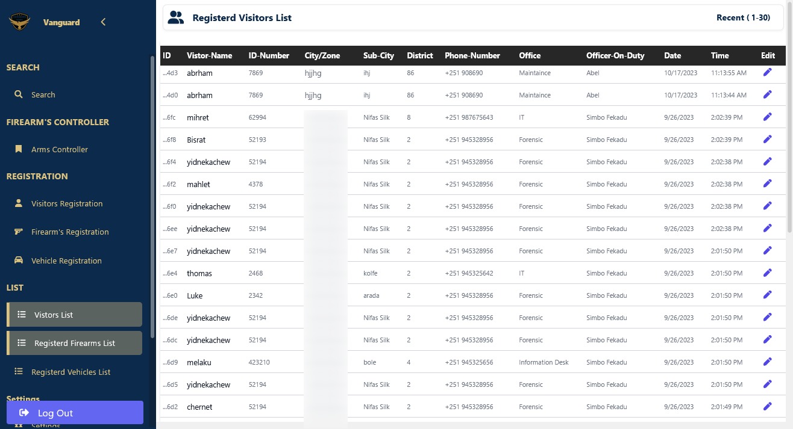

# GateWay Registry System

GateWay Registry System provides a robust, secure, and analytical way to track gate activity, ensuring the safety and control of any organization's entry points. This system allows companies to manage and monitor who enters and exits their facilities, maintaining a comprehensive log of all gate-related activities. It includes a dashboard for real-time analytics, logs, and access management.


## Screenshots










## Features

- **Real-time Gate Monitoring**: Track gate activity in real-time with a live dashboard.
- **Detailed Logs**: Keep records of all entry and exit activities for analysis.
- **Access Control**: Manage who has access to which gates within the company premises.
- **Analytics and Reporting**: Generate comprehensive reports on gate usage for security audits.
- **Role-Based Access**: Different access levels for administrators, security personnel, and guests.

## Project Directory Structure

```bash
GateWay-Registry-System/
│
├── Admin-Dashboard/                 # Frontend source code
│   ├── public/             # Static files for the frontend
│   ├── src/                # React components and application logic
│   ├── package.json        # Frontend dependencies and scripts
│   └── ...
├── Main-Application/                 # Frontend source code
│   ├── public/             # Static files for the frontend
│   ├── src/                # React components and application logic
│   ├── package.json        # Frontend dependencies and scripts
│   └── ...
│
├── server/                 # Backend source code
│   ├── controllers/        # Business logic for API routes
│   ├── models/             # Database schemas and models
│   ├── routes/             # API routes for the server
│   ├── package.json        # Backend dependencies and scripts
│   └── ...
│
├── README.md               # Project documentation
``` 


## Technologies Used

- **Frontend**: The frontend is built using React.js, a powerful library for building user interfaces. It is responsive and uses modern JavaScript (ES6+) features.
- **Backend**: The backend is built using Node.js and Express.js to handle server requests and manage the API logic.
- **Database**: MongoDB is used for storing gate activity logs and user information securely.
- **Authentication**: JWT (JSON Web Tokens) is used for securing API endpoints and ensuring only authorized personnel can access certain features.
- **Real-Time Updates**: Socket.IO is implemented for real-time gate activity updates.
- **Deployment**: The application is containerized using Docker for easy deployment.

## Installation

- **Clone the repository**
      
      git clone https://github.com/arod12345/GateWay-Registry-System.git
      cd GateWay-Registry-System

Install dependencies for the frontend and backend

Navigate to the client and server folders and run the following commands:

-**For the Frontend**:   
          
           cd client
           npm install

    


-**For the Backend**:

        cd server
        npm install

## Running the Application

After installing all dependencies, follow these steps to start the application.

Start the Frontend:

    npm run dev

Start the Backend:

    npm run server

Both frontend and backend should now be running, and the application can be accessed at http://localhost:5173 for the frontend.

## Add a ENV File

Add ENV file to your ```server``` directory

   ```
   PORT=8000
   NODE_ENV='development'
   JWT_SECRET=cd54c0ecd3ae71cb3eeeaac920ec801639bbbc4f0bdae260a5c469d118714249301ee8a83c701050ac226e2d0ffd66279142cbb810b67288fb539f1a836bec1a
   JWT_SECRET_ADMIN=cd49303fb7c93a58208d90beadb43ff548224a9d5c79006b09fb67f060416b1a9adfd0709430269e4ef9bd21b41071908ff86aebe39908ceff63e95e10d85b997384529029037489298347
   DATABASE_URL=put your own momgodb database Url
```
 

- **Live Demo**

Check out the live demo of the GateWay Registry System at: 
     
     https://gate-way-registry-system.vercel.app
     https://gate-way-registry-system-okoy.vercel.app/

The source code for this project is available on GitHub:

    https://github.com/arod12345/GateWay-Registry-System 

Feel free to clone the repository and contribute!
Conclusion

- The GateWay Registry System offers an essential solution for any company needing to secure and monitor their gates. With real-time monitoring, comprehensive logs, and detailed analytics, companies can ensure the safety and security of their facilities. The system is designed to be scalable and customizable, making it suitable for businesses of all sizes.


Let me know if you need any adjustments!👋👋👋
